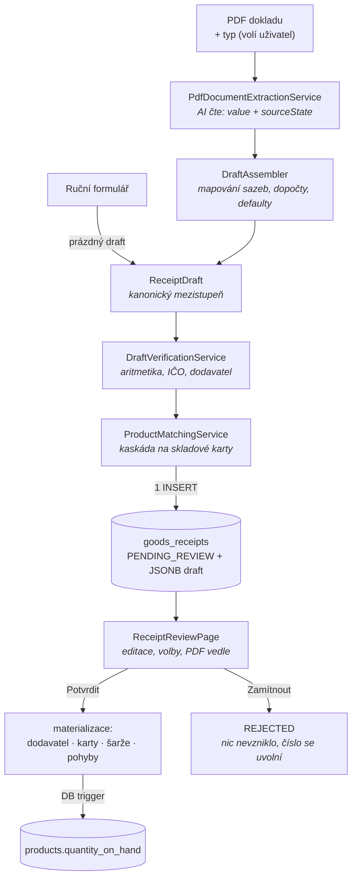

# Průvodce implementací: Import příjemek (draft pipeline)

> Detailní technický průvodce — soubor po souboru, s kódem a zdůvodněním rozhodnutí.
> Určeno pro vývojáře, kteří chtějí implementaci pochopit do hloubky (onboarding, code review, vzor pro další AI integrace).
> Stručný funkční přehled: [docs/funkce/import-prijemek.md](../funkce/import-prijemek.md). Stav k 20. 7. 2026, větev `sklad`, migrace V39–V41.

## Obsah

1. [Co funkce dělá a proč vznikla](#1--co-funkce-dělá-a-proč-vznikla)
2. [Tok dat — architektura v kostce](#2--tok-dat--architektura-v-kostce)
3. [Databáze: migrace V39–V41](#3--databáze-migrace-v39v41)
4. [Kanonický draft a stavy polí](#4--kanonický-draft-a-stavy-polí)
5. [AI extrakce: tracked fields místo confidence](#5--ai-extrakce-tracked-fields-místo-confidence)
6. [DraftAssembler — kód skládá a dopočítává](#6--draftassembler--kód-skládá-a-dopočítává)
7. [DraftVerificationService — kód počítá a ověřuje](#7--draftverificationservice--kód-počítá-a-ověřuje)
8. [Import: jeden INSERT a dost](#8--import-jeden-insert-a-dost)
9. [Review workflow: confirm / reject](#9--review-workflow-confirm--reject)
10. [Párovací kaskáda produktů](#10--párovací-kaskáda-produktů)
11. [Dedup dodací list ↔ faktura](#11--dedup-dodací-list--faktura)
12. [Ruční příjemka — payoff kanonického draftu](#12--ruční-příjemka--payoff-kanonického-draftu)
13. [Frontend](#13--frontend)
14. [Testy — tři úrovně](#14--testy--tři-úrovně)
15. [Pasti a poznámky (Jackson 3, MyBatis + JSONB)](#15--pasti-a-poznámky-jackson-3-mybatis--jsonb)

---

## 1 · Co funkce dělá a proč vznikla

Původní import (fáze Warehouse 3) naskladňoval **okamžitě při nahrání PDF**: AI extrakce → rovnou produkty, šarže a pohyby. Audit odhalil čtyři vady, které si vynutily přestavbu:

1. dodací list („Není daňový doklad") nemá rozpis DPH → import padal na `vat_amount NOT NULL` a vznikl dočasný hack `vat_amount = 21` (konstanta v Kč!),
2. potvrzovací workflow neexistoval — `ReceiptStatus.CONFIRMED` nikdo nikdy nenastavil, přestože na něm stojí filtry importu položek do zakázky,
3. sklad rostl **před** jakoukoliv kontrolou, i při selhané rekonciliaci,
4. `products.sku` = kód dodavatele → stejný díl od druhého dodavatele založil duplicitní kartu.

Cílový stav: import (nebo ruční formulář) vyrobí **draft ke kontrole**; na sklad se cokoliv dostane až lidským potvrzením. Návrh je popsán ve funkčním dokumentu; tady jdeme do kódu.

## 2 · Tok dat — architektura v kostce



Dvě klíčové věty: **každý vstupní kanál končí stejným draftem** (nový formát dokladu = nový adaptér, zbytek pipeline beze změny) a **jediné místo, kde vznikají skladová data, je potvrzení** (`ReceiptReviewServiceImpl.confirm`).

## 3 · Databáze: migrace V39–V41

### V39 — draft workflow

📄 `src/main/resources/db/migration/V39__receipt_draft_workflow.sql`

```sql
CREATE TYPE warehouse.document_type  AS ENUM ('INVOICE', 'DELIVERY_NOTE');
CREATE TYPE warehouse.receipt_source AS ENUM ('AI_PDF', 'MANUAL', 'ISDOC');

ALTER TABLE warehouse.goods_receipts
    ADD COLUMN document_type  warehouse.document_type  NOT NULL DEFAULT 'INVOICE',
    ADD COLUMN source_channel warehouse.receipt_source NOT NULL DEFAULT 'AI_PDF',
    ADD COLUMN draft_payload  JSONB,
    ADD COLUMN confirmed_at TIMESTAMPTZ, ADD COLUMN confirmed_by BIGINT,
    ADD COLUMN rejected_at  TIMESTAMPTZ, ADD COLUMN rejected_by  BIGINT,
    ADD COLUMN rejection_note VARCHAR(500);
```

Tři rozhodnutí, která stojí za vysvětlení:

- **Hlavička je od V39 nullable** (`supplier_id`, `invoice_number`, součty…). Draft smí být neúplný — závazná data drží JSONB payload a hlavičkové sloupce jsou jen jeho *dotazovatelná projekce* (kvůli seznamům a indexům). Úplnost vynucuje nový CHECK `chk_receipt_confirmed_complete`: `status <> 'CONFIRMED' OR (vše vyplněno)` — tedy DB garantuje, že potvrzená příjemka je kompletní, ale draftu nechává volnost.
- **Idempotence přes partial unique index** místo původního UNIQUE constraintu:

  ```sql
  CREATE UNIQUE INDEX uq_receipt_supplier_docno
      ON warehouse.goods_receipts (supplier_id, invoice_number)
      WHERE status <> 'REJECTED';
  ```

  Zamítnutý doklad tím **uvolní své číslo** — po opravě PDF ho lze importovat znovu, aniž bychom zamítnuté řádky mazali (audit se neztrácí).
- **Backfill dev dat**: příjemky importované starou pipeline byly `PENDING_REVIEW`, ale šarže a pohyby už měly. Pod novou sémantikou by to byl protimluv, proto je V39 jednorázově přepne na `CONFIRMED` — byly reálně naskladněny, ledger zůstává append-only a FK z `order_items` (V27) se nerozbijí. Alternativa (smazat + kompenzační pohyby) by byla složitější a lhala by o historii.

`invoice_number` se vědomě **nepřejmenovává** na `document_number` (u dodacího listu nese jeho číslo) — rename by se rozlil do mapperů, DTO i FE za kosmetický zisk; sémantiku drží `COMMENT ON COLUMN` a TD-40.

### V40 — identita produktu

📄 `V40__product_identity_supplier_products.sql`

```sql
ALTER TABLE warehouse.products
    ADD COLUMN manufacturer_part_number VARCHAR(100),
    ADD COLUMN part_number_normalized VARCHAR(100)
        GENERATED ALWAYS AS (
            NULLIF(regexp_replace(upper(manufacturer_part_number), '[ .\-]', '', 'g'), '')
        ) STORED;

CREATE TABLE warehouse.supplier_products (
    supplier_id  BIGINT NOT NULL,  supplier_sku VARCHAR(100) NOT NULL,
    product_id   BIGINT NOT NULL,  ...
    CONSTRAINT uq_supplier_products UNIQUE (supplier_id, supplier_sku)
);
```

Standardní ERP vzor „supplier item cross-reference" (SAP purchasing info records, D365 external item numbers): **interní karta + převodní tabulka kódů dodavatelů**. `part_number_normalized` je **generovaný sloupec** — normalizaci (velká písmena, bez mezer/teček/pomlček) vlastní DB, takže ji nelze rozejít s aplikací; Java používá tutéž normalizaci při dotazu (`ProductMatchingService.normalize`). `products.sku` zůstává jako lidsky čitelné „hlavní katalogové číslo", ale **přestává být párovací identitou**.

Backfill přelije dnešní `sku` do převodníku podle provenience: produkt → nejstarší šarže → příjemka → dodavatel. Produkty bez šarží (ručně založené karty) proveniencí neprošly a záznam nedostanou — správně, není odkud ho vzít.

`CREATE EXTENSION pg_trgm` zapíná trigramovou podobnost pro našeptávání podle názvu (GIN index `idx_products_name_trgm`).

### V41 — DL reference

📄 `V41__receipt_delivery_note_refs.sql` — tabulka `receipt_delivery_note_refs` (faktura → čísla dodacích listů, `matched_receipt_id`, `resolution LINKED/RESTOCKED`). Detailně v [§11](#11--dedup-dodací-list--faktura).

## 4 · Kanonický draft a stavy polí

📄 `src/main/java/cz/palo/autoservis/model/draft/` — `ReceiptDraft`, `TrackedField`, `FieldState`, `DraftLine`, `DraftSupplier`, `DraftCheck`, `DeliveryNoteRef`

Každé pole dokladu je dvojice hodnota + stav:

```java
public class TrackedField<T> {
    private T value;
    private FieldState state;

    /** Povýší na VERIFIED, jen pokud pole nese přečtenou/dopočtenou hodnotu. */
    public void verify() {
        if (state == FieldState.VERBATIM || state == FieldState.DERIVED) {
            state = FieldState.VERIFIED;
        }
    }
}
```

Šest stavů a **kdo který smí nastavit** — to je jádro celého návrhu:

| Stav | Význam | Nastavuje |
|---|---|---|
| `VERBATIM` | opsáno doslova z dokladu | model (extrakce) |
| `DERIVED` | dopočteno z jiných hodnot dokladu | model nebo `DraftAssembler` |
| `DEFAULTED` | chybí → default z konfigurace | `DraftAssembler` |
| `VERIFIED` | prošlo křížovou kontrolou | **výhradně** `DraftVerificationService` |
| `ABSENT` | chybí a nemá default | `DraftAssembler` |
| `EDITED` | změněno člověkem | frontend (review) |

Všimni si `verify()`: `DEFAULTED` se na `VERIFIED` **nikdy nepovyšuje**. U dodacího listu je sazba 21 % jen domněnka z konfigurace — i když s ní matematika vyjde, pořád je to domněnka a UI ji má ukazovat žlutě.

Draft se serializuje do `goods_receipts.draft_payload` (JSONB) i s `schemaVersion` — levná pojistka pro budoucí evoluci tvaru. Po potvrzení/zamítnutí zůstává jako **zmrazený snapshot** (co přesně kontrolor viděl a schválil).

## 5 · AI extrakce: tracked fields místo confidence

📄 `model/dto/warehouse/DocumentExtractionResult.java` + `service/PdfDocumentExtractionService.java`

Spring AI odvodí JSON schéma z recordu a odpověď naparsuje (`.entity(...)`). Record je celý „tracked":

```java
public enum SourceState { VERBATIM, DERIVED, ABSENT }
public record F(String value, SourceState state) {}
public record Line(LineKind kind, Integer position,
                   F catalogNumber, F name, F unit,
                   FDec quantity, FDec unitPriceExclVat,
                   F vatRateOrCode,          // "21", "21%" NEBO písmeno "C"
                   FDec totalExclVat, FDec totalInclVat,
                   String deliveryNoteNumber) {}
```

**Proč původ hodnoty, a ne confidence?** LLM neumí kalibrovanou pravděpodobnost — číslo 0.87 by bylo divadlo. Umí ale spolehlivě říct, *odkud hodnotu má*: opsal ji (VERBATIM), spočítal z jiných vytištěných hodnot (DERIVED), nebo tam prostě není (ABSENT — „NIKDY si hodnoty nevymýšlej"). Jistotu pak určuje deterministický kód (§7). To je rozšíření projektové zásady **„AI čte, kód počítá"**.

System prompt má sdílené jádro + dodatek podle typu dokladu (typ volí **uživatel** při uploadu — u financí nespoléháme na klasifikaci modelem). Jádro řeší pasti reálných dokladů ze složky `import/`:

- **písmenné sazby LKQ** — „opiš PŘESNĚ… písmenné kódy NEPŘEVÁDĚJ; převodní tabulku vrať zvlášť ve vatRecap" (A 0 %, B 12 %, C 21 %),
- **skupinové řádky** — „řádek `Dodací list č. 3726025144 celkem…` je `kind=DELIVERY_NOTE_GROUP`… NENÍ to položka",
- **poškozená textová vrstva** (AUTO RAVIRA, MRP software) — „čti údaje vizuálně ze vzhledu stránky".

Konfigurační detail: `max-tokens: 8192` — tracked fields zdvojnásobují objem výstupu, s původními 4096 by delší faktura nedoběhla. Ověřeno manuálním testem nad všemi čtyřmi reálnými PDF (§14): rekonciliace 4/4.

## 6 · DraftAssembler — kód skládá a dopočítává

📄 `service/DraftAssembler.java`

Extrakce + typ dokladu → kanonický draft. Tady se dělá vše, co model dělat nesmí:

```java
private TrackedField<Integer> resolveVatRate(F rateOrCode, List<VatRecapRow> recap,
                                             LineKind kind, DocumentType documentType) {
    // "21" / "21%" → VERBATIM;  písmeno → lookup v extrahované rekapitulaci → DERIVED
    ...
    if (documentType == DocumentType.DELIVERY_NOTE) {
        return TrackedField.defaulted(defaults.getVatRate());   // DL: default 21 %
    }
    return TrackedField.absent();                               // faktura bez sazby = flag k revizi
}
```

Poslední dva řádky jsou rozhodnutí z roadmapy: chybějící sazba je u dodacího listu **očekávaná** (→ DEFAULTED), u faktury **podezřelá** (→ ABSENT; sazba je povinné pole, takže prázdné → červený rámeček, bez doplnění nejde potvrdit).

Dále: dopočet částek řádku sdílí helper `deriveLineAmounts` **oběma směry** — `totalInclVat = totalExclVat × (1 + sazba)` (LKQ tiskne řádkové součty jen bez DPH) i **zpětně** `totalExclVat = totalInclVat / (1 + sazba)` a `unitPrice = totalExclVat / množství` (ručně psané doklady mívají jen cenu s DPH); vše `setScale(2, HALF_UP)`. Hlavičkové součty dodacího listu z řádků (subtotal = Σ bez DPH, vatAmount = Σ s DPH − Σ bez DPH — tím zmizel hack `vat_amount = 21`), defaulty z `WarehouseImportProperties` (`warehouse.import.defaults` v `application.yaml` — vědomě yaml, ne DB: mění je vývojář, bean je jediný šev pro případný přesun).

Veřejná metoda `fillDerivedValues(draft)` je tatáž dopočtová logika pro **editaci a ruční příjemku** — doplňuje jen ABSENT hodnoty, nikdy nepřepisuje vyplněné (§12).

## 7 · DraftVerificationService — kód počítá a ověřuje

📄 `service/DraftVerificationService.java`

Sedm deterministických kontrol; výsledky jdou do `draft.checks[]` (UI ukazuje, *která* kontrola selhala, ne jen boolean):

| Kontrola | Co ověřuje |
|---|---|
| `LINE_MATH` (per řádek) | qty × cena ≈ součet bez DPH **a** součet bez DPH × (1+sazba) ≈ s DPH |
| `LINES_SUM_VS_RECAP` | Σ základů řádků po sazbách vs. řádky rekapitulace |
| `RECAP_SUM` | Σ rekapitulace vs. hlavičkové subtotal/vatAmount |
| `SUBTOTAL_PLUS_VAT_EQ_TOTAL` | základ + DPH = celkem |
| `LINES_SUM_VS_TOTAL` | Σ řádků s DPH vs. celková částka (dřívější `InvoiceReconciliationValidator`, pohlcen) |
| `ICO_CHECKSUM` | mod 11 kontrolní součet českého IČO |
| `SUPPLIER_KNOWN` | normalizované IČO nalezeno ve `warehouse.suppliers` |

Kontroly s tolerancí `0.05` (haléřová zaokrouhlení dokladů). Pole, jejichž hodnoty prošly kontrolou, se povyšují `verify()` na VERIFIED. `reconciliation_ok` = **všechny aritmetické kontroly** prošly — včetně `LINE_MATH`: vnitřně nekonzistentní řádek (sazba nesedí na poměr cen) znamená, že model něco přečetl špatně, i kdyby hlavička sama seděla.

IČO checksum pro zvídavé: váhy 8..2 na prvních 7 číslicích, `expected = (11 − sum % 11) % 10` — jeden výraz pokrývá i speciální případy (mod 0 → 1, mod 1 → 0). Ověřeno na reálných IČO ze vzorových dokladů (LKQ 24787426, AUTO RAVIRA 60715413).

Dodavatel se tu jen **hledá** (`matchedSupplierId`, `matchState AUTO/NONE`) — nikdy nezakládá. Vznik dodavatele patří až do potvrzení; tím zmizel dřívější 422 `SUPPLIER_NOT_EXTRACTED` při importu.

## 8 · Import: jeden INSERT a dost

📄 `service/impl/WarehouseImportServiceImpl.java`

```java
// 1) AI čte
DocumentExtractionResult extracted = extractionService.extract(pdfBytes, documentType);
// 2) kód skládá kanonický draft
ReceiptDraft draft = draftAssembler.assemble(extracted, documentType, extractionModel);
// 3) kód počítá + páruje (dodavatel, karty, DL reference)
boolean reconciliationOk = verificationService.verify(draft);
productMatchingService.matchLines(draft);
verificationService.matchDeliveryNoteRefs(draft, null);
// 4) idempotence — jen při napárovaném dodavateli a čísle dokladu
// 5) JEDINÝ zápis: hlavička (projekce draftu) + JSONB payload, PENDING_REVIEW
mapper.insertReceipt(receipt);
```

Žádné `products`, `goods_receipt_items` ani `stock_movements` — to je **klíčový invariant** celé přestavby a první assert integračního testu. Originál PDF se ukládá do `source_pdf` (BYTEA, daňový archiv) spolu s `extraction_model` (dohledatelnost, který model extrahoval).

Duplicita (409 `DUPLICATE_IMPORT`) se hlásí jen když je dodavatel napárovaný — draft neznámého dodavatele nemá proti čemu kontrolovat; podruhé se totéž kontroluje při potvrzení (to už dodavatel existuje).

## 9 · Review workflow: confirm / reject

📄 `controller/warehouse/GoodsReceiptReviewController.java` (7 endpointů pod `/warehouse/receipts`, celý `@PreAuthorize`), `service/impl/ReceiptReviewServiceImpl.java`, `resources/mapper/warehouse/ReceiptReviewMapper.xml`

**`PUT /{id}/draft`** — uloží editovaný draft: přečísluje pozice řádků, `fillDerivedValues`, znovu spustí verifikaci i párování (`EDITED` stavy posílá FE — ví, co uživatel změnil; kaskáda nikdy nepřepisuje `CONFIRMED` volby), synchronizuje hlavičkovou projekci.

**`POST /{id}/confirm`** — jediné místo materializace:

1. **completeness gate** (`validateCompleteness`) — sbírá chyby najednou do `BusinessRuleException("RECEIPT_INCOMPLETE", …, params)`: povinná hlavička, ≥1 položka, na řádcích název + **katalogové číslo** (jen když řádek zakládá **nový** produkt — products.sku je NOT NULL; řádek napárovaný na existující kartu SKU nepotřebuje) + množství > 0 + ceny + sazba, žádné nevyřešené `SUGGESTED` párování, žádná nerozhodnutá DL reference;
2. vyřešení dodavatele — `matchedSupplierId`, nebo **teprve teď** insert z extrahovaných dat;
3. re-check duplicity (s vyloučením sebe sama — parametr `excludeReceiptId`);
4. per ITEM řádek: vyřešení karty (§10) → **upsert `supplier_products`** (samoučení) → insert šarže (`quantity_remaining = quantity_received`) → insert pohybu `RECEIPT` (stav skladu navýší trigger `fn_apply_stock_movement` z V18 — aplikace `quantity_on_hand` nikdy nezapisuje);
5. guarded přechod stavu.

**Guarded přechody** — ochrana proti souběhu bez zamykání:

```xml
<update id="confirm">
    UPDATE warehouse.goods_receipts
    SET status = 'CONFIRMED', ...
    WHERE id = #{id}
    AND status = 'PENDING_REVIEW'   <!-- druhý confirm aktualizuje 0 řádků -->
</update>
```

Service kontroluje počet aktualizovaných řádků; 0 → `ConflictException("RECEIPT_ALREADY_PROCESSED")` → 409. Pro malou dílnu je optimistická kontrola přiměřenější než SELECT FOR UPDATE.

**`POST /{id}/reject`** — jen stavový přechod + poznámka; nic nevzniklo, takže není co stornovat, a partial index uvolní číslo dokladu.

Mapper drží dvě hygienická pravidla: `source_pdf` (BYTEA) se **nikdy nenačítá v seznamu ani detailu** (má vlastní select `findPdfById`) a JSONB se čte jako `draft_payload::text` / zapisuje `CAST(#{draftPayload} AS jsonb)` — doména nese payload jako `String`, serializaci dělá service (žádný custom TypeHandler).

DTO poznámka: draft se v detailu i PUT přenáší **přímo jako `ReceiptDraft`** — je to už serializační model (JSONB payload); paralelní DTO strom by strukturu jen dubloval. Hlavička jde klasicky přes `ReceiptDto` + `ReceiptConverter`.

## 10 · Párovací kaskáda produktů

📄 `service/ProductMatchingService.java` + `resources/mapper/warehouse/ProductMatchingMapper.xml`

```
1. supplier_products (dodavatel + jeho kód)   → AUTO       (jediný krok, kterému věříme sami)
2. normalizované číslo dílu                   → SUGGESTED  (vybírá člověk)
   – plné ("EL871180") i bez brand prefixu ("871180")
3. pg_trgm podobnost názvu (> 0.45, top 3)    → SUGGESTED
4. nic                                        → NONE       (potvrzení založí novou kartu)
```

Proč prefix-parsing nikdy nevede na AUTO: „EL 871.180" je *kód dodavatele LKQ* — prefix „EL" znamená Elring, ale tu znalost nemáme v datech, jen heuristicky (2–4 písmena + mezera). Špatně odhadnutý prefix tak smí stát nejvýš jeden klik člověka navíc, nikdy tichou záměnu dílu. Ze stejného důvodu je podobnost názvů jen návrh.

**Samoučení**: co člověk v review potvrdí, `confirm` upsertne do `supplier_products` (`ON CONFLICT … DO UPDATE`). Příští faktura téhož dodavatele se stejným kódem projde krokem 1 automaticky. Stejný princip feedback-loop používají komerční nástroje (Rossum).

Sémantika `productMatch` na řádku draftu: `AUTO`/`CONFIRMED` s `productId` → napojit na existující kartu; `CONFIRMED` s `productId = null` = explicitní volba „nový produkt"; `NONE` → nová karta; `SUGGESTED` → **blokuje potvrzení** (completeness gate).

## 11 · Dedup dodací list ↔ faktura

LKQ vzor ze vzorových dokladů: zboží přijde nejdřív **dodacím listem** (naskladní se) a později ho kryje **souhrnná faktura**, která tytéž položky opakuje pod skupinovým řádkem „Dodací list č. X celkem…". Import obou dokladů bez ochrany = dvojí naskladnění.

Řešení ve třech krocích:

1. **extrakce** označí skupinový řádek `DELIVERY_NOTE_GROUP` s číslem DL (a model číslo DL přiřazuje i položkám pod ním — `deliveryNoteNumber` na ITEM řádku); `DraftAssembler` čísla sebere do `draft.deliveryNoteRefs[]`;
2. **párování** (`DraftVerificationService.matchDeliveryNoteRefs`) dohledá k číslům existující `DELIVERY_NOTE` příjemky (ne-REJECTED, při známém dodavateli jen jeho) a naplní `matchedReceiptId`; reference se zrcadlí do tabulky `receipt_delivery_note_refs`;
3. **rozhodnutí člověka** v review — banner s volbou:
   - `LINKED` — jen provázat: ITEM řádky nesoucí číslo krytého DL se při materializaci **přeskočí** (a přeskočí je i completeness gate),
   - `RESTOCKED` — naskladnit i podruhé (vědomé rozhodnutí, např. zboží skutečně přišlo znovu).

   Napárovaná reference **bez rozhodnutí blokuje potvrzení** (`unresolvedDeliveryNotes` v RECEIPT_INCOMPLETE).

## 12 · Ruční příjemka — payoff kanonického draftu

📄 `ReceiptReviewServiceImpl.createManualDraft` + `POST /warehouse/receipts`

Ruční vkládání není druhý formulář ani druhá cesta kódu: endpoint založí **prázdný draft** (`source_channel = MANUAL`, hlavička ABSENT, měna DEFAULTED, žádné PDF) a frontend rovnou naviguje do téže kontrolní obrazovky. Uživatel přidává řádky („Přidat řádek" — pole ABSENT, MJ/sazba DEFAULTED), při uložení server přečísluje pozice, `fillDerivedValues` dopočte součty (3 ks × 100 Kč → 300 bez DPH → 363 s DPH → hlavička) a dál platí úplně stejná verifikace, párování i completeness gate jako u AI importu. `GET /{id}/pdf` vrací 404, FE panel PDF skryje (`hasPdf`).

Tohle je důvod, proč kanonický draft existoval od fáze 2: ruční příjemka i ISDOC adaptér jsou jen jiné způsoby, jak draft naplnit.

> **Aktualizace (E7/E8, 2026-07-21):** ISDOC adaptér už není budoucí — `IsdocParser` parsuje český
> standard e-faktury (XSD 6.0.2) do téhož draftu, všechna pole VERBATIM, bez AI. AI cesta navíc
> přijímá i fotku/sken dokladu. Detail a mapování elementů: [funkce/import-prijemek.md](../funkce/import-prijemek.md).
> Tento průvodce popisuje stav k 20. 7. 2026 (migrace V39–V41) a novější fáze do něj nejsou zapracované —
> autoritativní jsou funkční dokumenty.

## 13 · Frontend

📄 `src/pages/ReceiptsPage.jsx`, `src/pages/ReceiptReviewPage.jsx`, `src/components/ReceiptDraftHeaderForm.jsx`, `ReceiptDraftLinesTable.jsx`, `FieldStateBadge.jsx`

- **ReceiptsPage** — seznam s filtry (stav, typ, hledání), import modal (`GoodsReceiptImportModal` — radio faktura/dodací list; po úspěchu „Zkontrolovat" naviguje do review) a modal ruční příjemky.
- **ReceiptReviewPage** — drží pracovní kopii draftu v state; každá editace zapíše `{value, state: "EDITED"}` (FE ví, co se změnilo — server porovnávat nemusí). „Uložit koncept" = PUT draftu (server vrátí přepočtený detail), „Potvrdit a naskladnit" nejdřív uloží rozeditované změny, pak POST confirm. PDF se načítá autentizovaně přes `api.getBlob` → object URL do `<iframe>` (s `revokeObjectURL` v cleanup effectu) — obyčejný `src` by neměl cookie kontext pro chráněný endpoint.
- **Stavy polí v UI** — dvě oddělené osy: **původ hodnoty** (`FIELD_STATE_META` ve `format.js` — ikona + barva; `FieldStateBadge` VERBATIM nezobrazuje, žlutá DERIVED/DEFAULTED = „zkontroluj", `ABSENT` neutrálně „není na dokladu") a **akce nutná** — červený rámeček `is-invalid` jen u **povinného prázdného** pole nebo neplatné hodnoty (jednotka mimo číselník). Povinnost zrcadlí completeness gate přes `REQUIRED_HEADER_FIELDS`/`REQUIRED_LINE_FIELDS`/`isLineFieldRequired` — `ABSENT` u nepovinného pole se červeně neznačí.
- **Volba karty** — sloupec „Skladová karta": AUTO zelený chip, SUGGESTED žlutý select kandidátů + „založit nový produkt", volba se zapíše jako `CONFIRMED`.
- **Neskladový řádek** — přepínač `ITEM`↔`NOTE` (tlačítka „Vyřadit z naskladnění" / „Zařadit jako položku", `onKindChange` v `ReceiptReviewPage`): práce a spotřební materiál se nenaskladní ani nevalidují.

## 14 · Testy — tři úrovně

| Úroveň | Soubor | Co kryje |
|---|---|---|
| **Unit** (bez Springu/DB) | `DraftAssemblerTest`, `DraftVerificationServiceTest`, `ProductMatchingServiceTest` | mapování písmenných sazeb, DL defaulty a dopočty; IČO checksum (parametrizovaně, reálná IČO), tolerance LINE_MATH, „DEFAULTED se nepovyšuje"; normalizace variant čísel |
| **Integrační** (Testcontainers, extrakce mockovaná) | `WarehouseImportServiceTest`, `ReceiptReviewServiceTest` | import = 1 řádek + 0 skladových dat; „C"+rekapitulace e2e; 409/201 vč. re-importu po REJECTED; confirm materializuje a trigger navýší sklad; dvojí confirm; stejný díl od 2. dodavatele → 1 karta; ruční příjemka; LINKED dedup |
| **Manuální** (skutečné API, mimo CI) | `PdfDocumentExtractionManualTest` | extrakce nad 4 reálnými PDF z `import/`; spuštění: `./mvnw test -Dtest=PdfDocumentExtractionManualTest -Dmanual.extraction=true` (vyžaduje `ANTHROPIC_API_KEY`) |

Poslední běh manuálního testu (20. 7. 2026): rekonciliace 4/4, skupinový řádek i poškozená textová vrstva zvládnuty, u dodacího listu DPH dopočtena z řádků (700,10 Kč — dřívější hack by uložil „21").

## 15 · Pasti a poznámky (Jackson 3, MyBatis + JSONB)

- **Jackson 3, ne 2.** Spring Boot 4 auto-konfiguruje `tools.jackson.databind.ObjectMapper` — bean `com.fasterxml.jackson…ObjectMapper` v kontextu **není** (context fail „No qualifying bean"). Serializace draftu proto používá `tools.jackson` (`JacksonException` je unchecked). Stejná past už byla popsaná u registru vozidel (`backend.md` §4b).
- **MyBatis + JSONB bez TypeHandleru**: doména nese JSON jako `String`, INSERT/UPDATE dělá `CAST(#{draftPayload} AS jsonb)`, SELECT `draft_payload::text`. Vzor převzatý z `RegistrySnapshotMapper.xml`.
- **BYTEA disciplina**: `source_pdf` má vlastní select — nikdy nesmí do `search`/`findById`, jinak seznam příjemek tahá megabajty.
- **Souběžná editace draftu**: last-write-wins nad guarded UPDATE — pro jednoho–dva kontrolory přiměřené; případný optimistic check na `updated_at` je poznámka v roadmapě.
- **Retence REJECTED draftů** (drží PDF v BYTEA) — úklid zatím nerozhodnut, poznámka v roadmapě §2.1.
