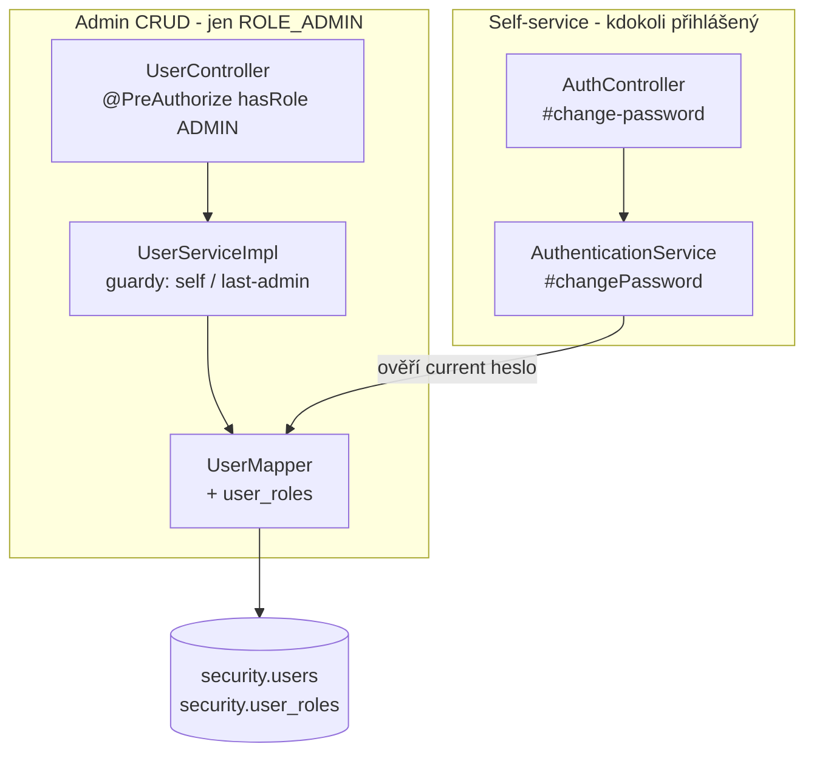

# Průvodce implementací: Správa uživatelů a hesel

> Detailní technický průvodce — soubor po souboru, s kódem a zdůvodněním rozhodnutí.
> Určeno pro vývojáře, kteří chtějí implementaci pochopit do hloubky (onboarding, code review, vzor pro další admin CRUD moduly nad existující tabulkou).
> Stručný funkční přehled: [docs/funkce/sprava-uzivatelu.md](../funkce/sprava-uzivatelu.md). Stav k 19. 7. 2026, větev `rje`, necommitnuto.

## Obsah

1. [Co chybělo a proč](#1--co-chybělo-a-proč)
2. [Tok dat — architektura v kostce](#2--tok-dat--architektura-v-kostce)
3. [Databáze — beze změny](#3--databáze--beze-změny)
4. [Mapper: paginace + JOIN na roli bez N+1](#4--mapper-paginace--join-na-roli-bez-n1)
5. [Role jako množina ID: delete + insert](#5--role-jako-množina-id-delete--insert)
6. [DTO a converter](#6--dto-a-converter)
7. [Service vrstva a guardy proti zamčení aplikace](#7--service-vrstva-a-guardy-proti-zamčení-aplikace)
8. [Dvě cesty ke změně hesla](#8--dvě-cesty-ke-změně-hesla)
9. [Controller a rolová autorizace](#9--controller-a-rolová-autorizace)
10. [Frontend](#10--frontend)
11. [Co chybí / známá omezení](#11--co-chybí--známá-omezení)

---

## 1 · Co chybělo a proč

Autentizace (`AuthController`, `AuthenticationService`, `security.mapper.UserMapper`) v projektu existovala od začátku — přihlášení, registrace, JWT refresh, logout. Chyběla ale administrativní vrstva nad stejnou tabulkou `security.users`: nikdo neměl jak založit účet zaměstnanci, změnit mu roli, deaktivovat ho při odchodu ze zaměstnání nebo mu resetovat zapomenuté heslo — jedinou cestou k účtu bylo self-service `/auth/register` (bez rolí) nebo přímý zápis do DB.

Zadání bylo: „navrhni endpoint pro správu uživatelů s CRUD operacemi", později rozšířené o „zahrň i frontend, reset a změnu hesla existujícího uživatele". Řešení tedy stálo na dvou existujících pilířích:

- **`security.users/roles/user_roles`** — hotové schéma z `V1__init_security_schema.sql`, žádná migrace nebyla potřeba.
- **Vzor `CustomerController`/`CustomerService`** — nejkomplexnější existující CRUD modul v projektu, use-case jako předloha pro vrstvení (mapper → converter → service → controller).

## 2 · Tok dat — architektura v kostce



Dvě oddělené vertikály sdílející jen mapper: **admin CRUD** (`UserController` → `UserServiceImpl`) je uzamčený za `@PreAuthorize`, zatímco **self-service změna hesla** (`AuthController` → `AuthenticationService`) je záměrně mimo `UserService` — viz [§8](#8--dvě-cesty-ke-změně-hesla).

## 3 · Databáze — beze změny

Žádná nová migrace. Tabulky `security.users`, `security.roles`, `security.user_roles` existují od `V1__init_security_schema.sql` (viz `databaze.md §1`). Jediná netriviální vlastnost, na kterou implementace naráží: **`security.users` nemá `is_active`**, soft-delete řeší už existující sloupec `enabled` (řídí i to, jestli se uživatel může přihlásit — `UserMapper.findByUsername` má `WHERE ... AND enabled = TRUE`). Admin CRUD tenhle sloupec jen převzal, žádný nový stavový příznak nepřidával.

## 4 · Mapper: paginace + JOIN na roli bez N+1

📄 `src/main/resources/mapper/UserMapper.xml`

Existující `UserWithRolesResultMap` (z autentizace) načítá uživatele s rolemi v jednom `LEFT JOIN` — ideální pro `findById`/`findByUsername`, kde je výsledkem jeden uživatel. Problém nastává u stránkovaného seznamu: `LIMIT`/`OFFSET` nad JOINovanými řádky by ořízlo *řádky JOINu*, ne uživatele (uživatel se 3 rolemi = 3 řádky, `LIMIT 10` by mohl vrátit jen 4 skutečné uživatele).

Řešení — nejdřív vybrat ID stránky podudotazem *bez* JOINu na role, teprve pak JOINout:

```xml
<select id="search" resultMap="UserWithRolesResultMap">
    SELECT u.id AS u_id, ... r.id AS r_id, r.name AS r_name, r.description AS r_description
    FROM security.users u
    LEFT JOIN security.user_roles ur ON ur.user_id = u.id
    LEFT JOIN security.roles      r  ON r.id       = ur.role_id
    WHERE u.id IN (
        SELECT u.id FROM security.users u
        <include refid="searchWhere"/>
        ORDER BY ... LIMIT #{params.pageSize} OFFSET #{params.offset}
    )
    ORDER BY ...  <!-- stejné řazení znovu, IN nezachovává pořadí poddotazu -->
</select>
```

> **Proč takhle**
> - Stejný princip jako `CustomerMapper.findById` vs. `search` (tam se problém neřeší poddotazem, protože `CustomerSearchParams` search needěruje na kolekce 1:N stejným způsobem) — tady je to nutné, protože `roles` je typická 1:N kolekce s proměnným počtem řádků na uživatele.
> - `ORDER BY` je nutné zopakovat i na vnějším dotazu — `WHERE id IN (...)` negarantuje pořadí, i kdyby ho poddotaz vracel seřazené.
> - `countSearch` JOIN na role vůbec nepotřebuje (počítá jen `security.users`), takže zůstává jednoduchý `COUNT(*)` s `searchWhere`.

Druhý drobný, ale důležitý fix: existující `findById`/`findByUsername` (dřív jen pro login) nikdy nenačítaly `created_at`/`updated_at` — pro autentizaci to nevadilo, ale nové `UserDto.DetailResponse` tato pole vystavuje. Doplněno do `UserWithRolesResultMap` i do všech tří SELECTů (`findByUsername`, `findById`, `search`), jinak by v API vždy vracela `null`.

## 5 · Role jako množina ID: delete + insert

Přiřazení rolí (`security.user_roles`, PK `(user_id, role_id)`) se při create i update řeší stejně — žádný diff, žádné „přidej tuhle, smaž tamtu":

```xml
<delete id="deleteRoles">
    DELETE FROM security.user_roles WHERE user_id = #{userId}
</delete>

<insert id="insertRoles">
    INSERT INTO security.user_roles (user_id, role_id, assigned_by)
    VALUES
    <foreach collection="roleIds" item="roleId" separator=",">
        (#{userId}, #{roleId}, #{assignedBy})
    </foreach>
</insert>
```

Service vrstva (`UserServiceImpl.update`) je volá v pořadí `deleteRoles` → `insertRoles` uvnitř stejné (implicitní) transakce jako `updateEmail`. `assigned_by` (audit sloupec z V1) se plní ID přihlášeného admina — stejná politika jako `created_by` jinde v projektu (R-04, nikdy z DTO).

> **Proč delete+insert, ne diff** — množina rolí u jednoho uživatele je malá (řádově jednotky), cena dvou dotazů je zanedbatelná a kód je o řád jednodušší a méně náchylný na chyby než výpočet přidaných/odebraných ID. Kdyby `user_roles` neslo víc dat než jen `assigned_at`/`assigned_by` (např. platnost role od-do), diff by dával smysl — tady ne.

## 6 · DTO a converter

📄 `src/main/java/cz/palo/autoservis/model/dto/user/UserDto.java`

Standardní namespace pattern (`CreateRequest`/`UpdateRequest`/`ListResponse`/`DetailResponse`/`ResetPasswordRequest`), jedna odlišnost od `CustomerDto`: **`UpdateRequest` neobsahuje `username`** — vůbec žádné pole, ne jen "immutable, ale posílané". Frontend (`UserForm`) posílá při update jen `{email, roleIds}` (`UsersPageEdit.onSave` explicitně destrukturuje jen tahle dvě pole), takže se ani neřeší otázka „co se stane, když klient pošle jiné username" — pole v kontraktu není.

📄 `src/main/java/cz/palo/autoservis/model/converter/UserConverter.java`

Menší než `CustomerConverter` — `applyUpdate` mapuje jen email (role jde mimo domain objekt, přímo přes mapper, viz §5). Za zmínku stojí `toRoleNames`/`toRoleDtos`: `ListResponse.roles` je `List<String>` (jen názvy, pro badge v tabulce), zatímco `DetailResponse.roles` je `List<RoleDto>` (id+name+description, pro předvyplnění checkboxů v edit formuláři) — dva pohledy na stejná data podle toho, co která obrazovka potřebuje.

## 7 · Service vrstva a guardy proti zamčení aplikace

📄 `src/main/java/cz/palo/autoservis/service/impl/UserServiceImpl.java`

```java
@Override
@Transactional
public UserDto.DetailResponse deactivate(Long id, Long currentUserId) {
    if (id.equals(currentUserId)) {
        throw new BusinessRuleException("CANNOT_DEACTIVATE_SELF",
                "Nelze deaktivovat vlastní uživatelský účet");
    }

    User user = userMapper.findById(id)
            .orElseThrow(() -> new ResourceNotFoundException("User", id));

    boolean isAdmin = user.getRoles() != null
            && user.getRoles().stream().anyMatch(r -> ROLE_ADMIN.equals(r.getName()));

    if (isAdmin && userMapper.countEnabledByRoleExcluding(ROLE_ADMIN, id) == 0) {
        throw new BusinessRuleException("CANNOT_DEACTIVATE_LAST_ADMIN",
                "Nelze deaktivovat posledního uživatele s rolí administrátora");
    }

    int affectedRows = userMapper.deactivate(id);
    return verifyAndFetchAfterStatusChange(id, affectedRows);
}
```

> **Proč dva guardy, ne jeden**
> `CANNOT_DEACTIVATE_SELF` řeší nejčastější reálnou chybu (admin si omylem klikne na svůj vlastní řádek). `CANNOT_DEACTIVATE_LAST_ADMIN` řeší jinou situaci — **cizí** admin deaktivuje **jiného** admina. Za normálních okolností (viz `JwtAuthenticationFilter`, který při každém requestu znovu načítá roli z DB) to skoro nejde nastat, protože volající sám musí být enabled `ROLE_ADMIN`, aby prošel přes `@PreAuthorize`, a tím pádem `countEnabledByRoleExcluding(cíl)` započítá aspoň jeho — pokud cíl ≠ volající. Guard je tu jako obranná vrstva pro edge-case (souběžné requesty, budoucí změna auth flow, přímý zásah do DB) — levný, korektní, a odpovídá běžné praxi (např. AWS IAM nedovolí smazat posledního uživatele s určitým oprávněním).
>
> Pořadí kontrol je záměrné: `CANNOT_DEACTIVATE_SELF` se testuje **před** načtením uživatele z DB — je to levnější kontrola (žádný dotaz) a self-deaktivace je i sémanticky jiná kategorie chyby.

Zbytek `UserServiceImpl` (create/update/getPage/resetPassword) drží stejné vzory jako `CustomerServiceImpl`: `existsByUsername`/`existsByEmail` → `UserAlreadyExistsException` (409) při create, `existsByEmail` (mimo sebe sama) → `BusinessRuleException("DUPLICATE_EMAIL")` (422) při update, verify-and-fetch po každé mutaci (R-03). Heslo se hashuje `PasswordEncoder.encode(...)` (stejný bean jako login) — nikdy se neukládá ani neloguje v plain textu (N-09).

## 8 · Dvě cesty ke změně hesla

Zadání explicitně žádalo „reset a změnu hesla existujícího uživatele" — to jsou **dvě různé operace s různou identitou volajícího**, a proto dva různé endpointy ve dvou různých vrstvách:

| | Admin reset | Self-service změna |
|---|---|---|
| Endpoint | `POST /users/{id}/reset-password` | `POST /auth/change-password` |
| Kdo smí volat | jen `ROLE_ADMIN` | kdokoli přihlášený, jen pro **svůj vlastní** účet (`id` se nebere z URL, ale z `@AuthenticationPrincipal`) |
| Vyžaduje současné heslo? | **ne** | **ano** — `passwordEncoder.matches(currentPassword, user.getPasswordHash())` |
| Kde žije | `UserController` → `UserServiceImpl.resetPassword` | `AuthController` → `AuthenticationService.changePassword` |
| Chyba při špatném vstupu | validace DTO (min. délka) | `BusinessRuleException("INVALID_CURRENT_PASSWORD")` → 422 |

```java
// AuthenticationService.java
@Transactional
public void changePassword(Long userId, ChangePasswordRequest request) {
    User user = userMapper.findById(userId)
            .orElseThrow(() -> new ResourceNotFoundException("User", userId));

    if (!passwordEncoder.matches(request.currentPassword(), user.getPasswordHash())) {
        throw new BusinessRuleException("INVALID_CURRENT_PASSWORD", "currentPassword",
                "Současné heslo není správné", Map.of());
    }
    userMapper.updatePasswordHash(userId, passwordEncoder.encode(request.newPassword()));
}
```

> **Proč `changePassword` není v `UserService`** — `UserService`/`UserController` je celý za `@PreAuthorize hasRole('ADMIN')`. Kdyby tam self-service změna hesla ležela, buď by musela mít vlastní výjimku z autorizace na úrovni metody (nekonzistentní, matoucí), nebo by non-admin uživatel nemohl změnit vlastní heslo vůbec. `AuthController` už obsahuje ostatní operace nad **vlastním** účtem přihlášeného uživatele (`/me`, login/logout/refresh) — `changePassword` tam sémanticky patří.
> Obě cesty sdílejí jen `UserMapper.updatePasswordHash` (nastaví `password_hash` i `password_changed_at`) a stejný `PasswordEncoder` bean.

## 9 · Controller a rolová autorizace

📄 `src/main/java/cz/palo/autoservis/controller/UserController.java`

```java
@RestController
@RequestMapping("/api/{version}/users")
@RequiredArgsConstructor
@PreAuthorize("hasRole('ADMIN')")   // celá třída, ne jednotlivé metody
public class UserController { ... }
```

Druhé místo v API s `@PreAuthorize` (první je `GoodsReceiptImportController`, `hasAnyRole('ADMIN','MANAGER','MECHANIC')`) — `@EnableMethodSecurity` už bylo zapnuté v `SecurityConfig`, žádná změna security configu nebyla potřeba. Detail konvence: `konvence.md §19`.

Endpointy 1:1 podle `CustomerController` (`GET/{id}`, `GET`, `POST`, `PUT/{id}`, `DELETE/{id}`, `POST/{id}/activate`) + jeden navíc (`POST/{id}/reset-password`). `DELETE` i `PUT` berou `@AuthenticationPrincipal AppUserDetails currentUser` — `DELETE` kvůli guardu v §7, `PUT`/`POST` kvůli `assigned_by` v §5.

`MeResponse` (`security/model/dto/MeResponse.java`) dostal nové pole `roles`:

```java
public record MeResponse(Long id, String username, String email, List<String> roles) {}
```

naplněné v `AuthController#me` z `userDetails.getAuthorities()` — použito na frontendu k zobrazení/skrytí položky „Uživatelé" v Sidebaru (§10), **ne** jako route guard (ten na frontendu neexistuje vůbec, viz `frontend.md §3`).

## 10 · Frontend

Struktura kopíruje `Customers*` (`UsersPage`/`UsersPageCreate`/`UsersPageEdit` + `UserForm` + `UserTable` + `useUserRowActions`), se třemi odlišnostmi:

- **`UserForm`** — `isEditMode` skrývá pole hesla úplně (ne jen disabled) a zamyká `username`; role jsou checkboxy plněné z `GET /code-lists/roles`, ne statický enum jako `CUSTOMER_TYPE_OPTIONS` ve `format.js`.
- **Dva nové modály** — `ResetPasswordModal` (admin, otevírá se z `TableRowActionMenu` v `UserTable` přes `useUserRowActions`) a `ChangePasswordModal` (self-service, otevírá se přímo ze `Sidebar`, mimo celý `Users*` flow — viditelná i uživatelům bez přístupu na `/users`).
- **`Sidebar.jsx`** — položka „Uživatelé" podmíněná `user?.roles?.includes('ROLE_ADMIN')`; `user` je odpověď `requireAuth()` (`/auth/me`), stejný objekt, který teď nese `roles`. Odkaz „Změnit heslo" podmínku nemá — je pro každého.

```jsx
// Sidebar.jsx
const isAdmin = user?.roles?.includes('ROLE_ADMIN')
...
{isAdmin && (
    <li className="nav-item">
        <NavLink to="/users">...Uživatelé</NavLink>
    </li>
)}
```

Žádné route guardy (`/users/*` je technicky dostupná URL i pro non-admina) — spoléhá se na to, že backend vrátí 403 na první API volání a UI zůstane nefunkční/prázdné. Je to stejný (nedokonalý, ale konzistentní s celým projektem) model jako u autentizace obecně — viz `frontend.md §3`, „Route guardy neexistují".

## 11 · Co chybí / známá omezení

- **Žádné automatizované testy** — na rozdíl od STK integrace (`docs/pruvodce/stk-registr.md §13`) tahle funkce nemá `*ServiceTest`/`*ControllerTest`. Ověřeno jen manuálně (curl přes všechny endpointy a guardy + reálný průchod v prohlížeči). Kandidát na doplnění, vzor by byl `CustomerServiceTest`/`WarehouseImportServiceTest`.
- **`CANNOT_DEACTIVATE_LAST_ADMIN` je za normálních okolností těžko vyvolatelný** jedním sledem requestů (viz §7) — spíš obranná vrstva než často testovaná cesta.
- **Frontend nemá route guard** — shoduje se s tím, jak se autentizace řeší v celém projektu, ale znamená to krátké „bliknutí" prázdné `/users` stránky pro non-admina, než přijde 403 (stejná kategorie jako obecný nedostatek popsaný ve `frontend.md §3`).
- **`docs/tech-dluhy.md` a `docs/roadmapa.md` nebyly touto funkcí aktualizovány** — pokud šlo o položku na roadmapě nebo z technického dluhu, zkontroluj a případně dopiš ručně (mimo rozsah automatického doplnění dokumentace k této funkci).

## Kde hledat dál

- [docs/funkce/sprava-uzivatelu.md](../funkce/sprava-uzivatelu.md) — funkční dokument (co + proč, stručně)
- [docs/backend.md](../backend.md) (sekce Security) · [docs/frontend.md](../frontend.md) (sekce Správa uživatelů) · [docs/api.md](../api.md) (sekce Uživatelé + Auth) · [docs/konvence.md §19](../konvence.md) — vrstvové detaily
- V aplikaci: `/users` (jen ROLE_ADMIN) a odkaz „Změnit heslo" v Sidebaru (kdokoli)
