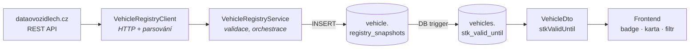

# Průvodce implementací: STK a registr vozidel

> Detailní technický průvodce — soubor po souboru, s kódem a zdůvodněním rozhodnutí.
> Určeno pro vývojáře, kteří chtějí implementaci pochopit do hloubky (onboarding, code review, vzor pro další integrace).
> Stručný funkční přehled: [docs/funkce/stk-registr.md](../funkce/stk-registr.md). Stav k 19. 7. 2026, větev `rje`, commity `20c0e40` → `deef210`.

## Obsah

1. [Co funkce dělá a odkud bere data](#1--co-funkce-dělá-a-odkud-bere-data)
2. [Tok dat — architektura v kostce](#2--tok-dat--architektura-v-kostce)
3. [Databáze: migrace V38](#3--databáze-migrace-v38)
4. [Konfigurace a RestClient](#4--konfigurace-a-restclient)
5. [HTTP klient registru](#5--http-klient-registru)
6. [Mapování hodnot: RegistryConverter](#6--mapování-hodnot-registryconverter)
7. [Persistence: domain + MyBatis XML](#7--persistence-domain--mybatis-xml)
8. [Service vrstva a transakce](#8--service-vrstva-a-transakce)
9. [Endpointy a orchestrace při create](#9--endpointy-a-orchestrace-při-create)
10. [Rozšíření modulu Vehicle](#10--rozšíření-modulu-vehicle)
11. [Zpracování chyb](#11--zpracování-chyb)
12. [Frontend](#12--frontend)
13. [Testy — tři úrovně](#13--testy--tři-úrovně)
14. [Známá omezení](#14--známá-omezení)

---

## 1 · Co funkce dělá a odkud bere data

U vozidel evidujeme stav STK z oficiálního Registru silničních vozidel (Datová kostka RSV, Ministerstvo dopravy). Zdrojem je veřejné REST API:

```
GET https://api.dataovozidlech.cz/api/vehicletechnicaldata/v2?vin=…   (i tp=…, orv=…; kombinují se jako AND)
hlavička: API_KEY: <klíč>                                              limit 27 dotazů / min / klíč

odpověď: { "Status": 1, "Data": { …cca 70 polí PascalCase… } }
```

Pro nás klíčová pole: `PravidelnaTechnickaProhlidkaDo` (platnost STK), `EvidencniProhlidkaDne`, `StatusNazev` („PROVOZOVANÉ", „ZÁNIK"…) a technická data pro předvyplnění formuláře (`TovarniZnacka`, `ObchodniOznaceni`, `Palivo`, `MotorZdvihObjem`, `MotorMaxVykon`, `VozidloKaroserieBarva`, `DatumPrvniRegistrace`). API **nevrací** rok výroby, SPZ, převodovku ani historii prohlídek — jen aktuální stav registru.

Uživatelsky funkce znamená: automatické načtení STK při založení vozidla, tlačítko „Načíst z registru" ve formuláři (předvyplní údaje včetně VIN při hledání přes ORV/TP), kartu STK na detailu vozidla, barevný badge v seznamu a filtr „Končící STK".

## 2 · Tok dat — architektura v kostce



Základní princip: **každé úspěšné volání registru = nový řádek** v tabulce snapshotů (append-only, nikdy se nic nepřepisuje). Denormalizovanou cache `vehicles.stk_valid_until` vlastní výhradně databázový trigger — aplikační kód ji nikdy nezapisuje. Je to stejný vzor, jaký v projektu už funguje pro tachometr (`mileage_history` → `current_mileage_km`, migrace V20).

## 3 · Databáze: migrace V38

📄 `src/main/resources/db/migration/V38__init_vehicle_registry_snapshots.sql`

```sql
CREATE TABLE vehicle.registry_snapshots (
    id                   BIGSERIAL   PRIMARY KEY,
    vehicle_id           BIGINT      NOT NULL,          -- FK → vehicles, ON DELETE CASCADE
    stk_valid_until      DATE,                          -- PravidelnaTechnickaProhlidkaDo
    last_inspection_date DATE,                          -- EvidencniProhlidkaDne
    registry_status      VARCHAR(100),                  -- StatusNazev — záměrně VARCHAR, ne ENUM!
    raw_response         JSONB       NOT NULL,          -- kompletní Data objekt z API
    fetched_at           TIMESTAMPTZ NOT NULL DEFAULT NOW(),
    created_by           BIGINT                         -- FK → security.users, ON DELETE SET NULL
);

CREATE INDEX idx_registry_snapshots_latest
    ON vehicle.registry_snapshots (vehicle_id, fetched_at DESC, id DESC);

ALTER TABLE vehicle.vehicles ADD COLUMN stk_valid_until DATE;

CREATE INDEX idx_vehicles_stk_valid_until
    ON vehicle.vehicles (stk_valid_until) WHERE is_active = TRUE;   -- partial index pro filtr
```

Synchronizační trigger — plný přepočet z nejnovějšího snapshotu:

```sql
CREATE OR REPLACE FUNCTION vehicle.fn_sync_stk_valid_until() RETURNS TRIGGER AS $$
DECLARE v_id BIGINT := COALESCE(NEW.vehicle_id, OLD.vehicle_id);
BEGIN
    UPDATE vehicle.vehicles v
    SET stk_valid_until = (SELECT s.stk_valid_until FROM vehicle.registry_snapshots s
                           WHERE s.vehicle_id = v_id
                           ORDER BY s.fetched_at DESC, s.id DESC LIMIT 1)
    WHERE v.id = v_id;
    RETURN NULL;
END; $$ LANGUAGE plpgsql;

CREATE TRIGGER trg_registry_snapshots_sync_stk
    AFTER INSERT OR UPDATE OR DELETE ON vehicle.registry_snapshots
    FOR EACH ROW EXECUTE FUNCTION vehicle.fn_sync_stk_valid_until();
```

> **Proč takhle**
> - **Snapshoty místo přepisu** — auditní historie „co registr kdy řekl"; surová odpověď v JSONB znamená, že až budeme potřebovat další pole (třeba `PocetVlastniku`), data už máme a nemusíme volat API s limitem 27 dotazů/min.
> - **`registry_status` je VARCHAR, ne PostgreSQL ENUM** — množinu hodnot řídí ministerstvo a může ji změnit bez varování. Rozhodnutí se potvrdilo hned první den: reálné API vrátilo stav „ZÁNIK", který v oficiální dokumentaci vůbec není. S ENUMem by INSERT spadl.
> - **Plný přepočet v triggeru** (ne inkrementální update) — trigger se sám „vyléčí" i po UPDATE nebo DELETE snapshotu, ne jen po INSERTu.

## 4 · Konfigurace a RestClient

📄 `src/main/resources/application.yaml`

```yaml
registry:
  dataovozidlech:
    base-url: https://api.dataovozidlech.cz
    api-key: ${DATAOVOZIDLECH_API_KEY:}    # prázdný default — boot nespadne bez klíče
    connect-timeout: 3s
    read-timeout: 5s
```

Hodnoty se bindují do typovaného recordu:

📄 `src/main/java/cz/palo/autoservis/config/registry/VehicleRegistryProperties.java`

```java
@ConfigurationProperties(prefix = "registry.dataovozidlech")
public record VehicleRegistryProperties(
        String baseUrl, String apiKey,
        Duration connectTimeout, Duration readTimeout) { }
```

📄 `src/main/java/cz/palo/autoservis/config/registry/VehicleRegistryClientConfig.java`

```java
@Bean
RestClient vehicleRegistryRestClient(VehicleRegistryProperties props) {
    JdkClientHttpRequestFactory factory = new JdkClientHttpRequestFactory(
            HttpClient.newBuilder().connectTimeout(props.connectTimeout()).build());
    factory.setReadTimeout(props.readTimeout());
    return RestClient.builder()
            .baseUrl(props.baseUrl())
            .defaultHeader("API_KEY", props.apiKey())   // klíč jde v hlavičce každého požadavku
            .requestFactory(factory)
            .build();
}
```

> **Proč takhle**
> - **První klasický REST klient v projektu** (Spring AI má vlastní infrastrukturu) — tenhle kód je vzor pro budoucí integrace. Bean má kvalifikované jméno `vehicleRegistryRestClient`, aby další klienti nekolidovali.
> - **Statický `RestClient.builder()` + JDK HttpClient** — Spring Boot 4 rozdělil auto-konfiguraci `RestClient.Builder` a `ClientHttpRequestFactorySettings` do samostatných modulů (`spring-boot-restclient`, `spring-boot-http-client`), které nemáme na classpath. Místo přidávání závislostí stačí čistý spring-web — na tohle jsme přišli až při implementaci, první verze s Boot API nešla zkompilovat.
> - **Krátké timeouty (3 s / 5 s)** — registr se volá synchronně z uživatelských requestů; pomalý registr nesmí blokovat obsluhu.
> - **Prázdný default klíče** `${DATAOVOZIDLECH_API_KEY:}` — bez něj by nenastartovala aplikace ani testy na stroji bez klíče. Bez klíče vše běží a volání registru vrací čisté 503, ne pád při startu. Skutečný klíč patří jen do gitignorovaného `application-local.yaml` nebo env proměnné (viz [nasazeni.md](../nasazeni.md) §7).

## 5 · HTTP klient registru

Rozhraní je záměrně minimální — jedna metoda, `Optional` jako odpověď na „vozidlo v registru není":

📄 `src/main/java/cz/palo/autoservis/client/VehicleRegistryClient.java`

```java
Optional<RegistryFetchResult> fetch(RegistryLookupParams params);
// RegistryLookupParams = record(vin, tp, orv) — API je kombinuje jako AND
// RegistryFetchResult  = record(RegistryVehicleData data, String rawJson)
```

Implementace čte tělo jako `String` a parsuje ho ručně:

📄 `src/main/java/cz/palo/autoservis/client/VehicleRegistryClientImpl.java`

```java
String body = vehicleRegistryRestClient.get()
        .uri(uri -> buildLookupUri(uri, params))       // queryParam jen pro neprázdné vin/tp/orv
        .retrieve()
        .body(String.class);
// … catch (RestClientResponseException e):   429 → RATE_LIMITED, 401/403 → AUTH_FAILED, jinak ERROR
// … catch (ResourceAccessException e):       síť/timeout → TIMEOUT

JsonNode root = objectMapper.readTree(body);            // tools.jackson — Jackson 3!
int status = root.path("Status").asInt(0);
JsonNode dataNode = root.get("Data");
if (status != 1 || dataNode == null || dataNode.isNull()) {
    return Optional.empty();                            // „není v registru" — validní odpověď, ne chyba
}
RegistryVehicleData data = objectMapper.treeToValue(dataNode, RegistryVehicleData.class);
return Optional.of(new RegistryFetchResult(data, dataNode.toString()));
```

> **Proč takhle**
> - **Ruční parsování Stringu** místo `retrieve().body(RegistryResponse.class)` — při překročení limitu vrací API 2xx s *plain-text* českou hláškou („…dosažen maximální počet požadavků…"), kterou by typovaný decode proměnil v nečitelnou chybu. Takhle ji rozpoznáme a přeložíme na `REGISTRY_RATE_LIMITED`. Marker hledáme diakritky-prostý („maxim"), protože text/plain bez charset se může dekódovat jako ISO-8859-1.
> - **`tools.jackson`, ne `com.fasterxml`** — Spring Boot 4 používá Jackson 3; fasterxml 2.x je na classpath jen transitivně a produkční `ObjectMapper` bean je Jackson 3. První verze klienta psaná proti Jacksonu 2 padala na mapování recordů.
> - **`dataNode.toString()` vedle mapovaného recordu** — do DB ukládáme kompletní JSON všech ~70 polí, ne jen náš výřez. Record `RegistryVehicleData` mapuje jen ~18 polí s explicitním `@JsonProperty` (registr míchá PascalCase s akronymy jako `VIN`, `CisloTp` — naming strategy by stejně potřebovala výjimky).

## 6 · Mapování hodnot: RegistryConverter

Registr vrací volný text; my potřebujeme typované hodnoty. Celé mapování řídí jedna filozofie: **nerozpoznaná hodnota → `null`, nikdy odhad**. Null pak ve formuláři znamená „pole se nedotýkej".

📄 `src/main/java/cz/palo/autoservis/model/converter/RegistryConverter.java`

```java
public FuelType mapFuel(String palivo, String vozidloElektricke, String vozidloHybridni) {
    if (parseAnoNe(vozidloElektricke)) return FuelType.ELECTRIC;   // příznak vyhrává nad textem
    String p = palivo == null ? "" : palivo.trim().toUpperCase(CZECH);
    boolean hybrid = parseAnoNe(vozidloHybridni);
    boolean petrol = p.startsWith("BA") || p.contains("BENZ");     // „BA 95 B"
    boolean diesel = p.startsWith("NM") || p.contains("NAFT");
    if (hybrid && petrol) return FuelType.HYBRID_PETROL;
    if (hybrid && diesel) return FuelType.HYBRID_DIESEL;
    if (petrol) return FuelType.PETROL;
    if (diesel) return FuelType.DIESEL;
    // … LPG, CNG, ELECTRIC, HYDROGEN …
    return null;                                                    // neznámé → null, ne OTHER!
}

public Short parsePowerKw(String motorMaxVykon) {      // „50 / 5000" = kW / otáčky
    Matcher m = FIRST_INT.matcher(motorMaxVykon);       // první celé číslo
    if (!m.find()) return null;
    int value = Integer.parseInt(m.group());
    return value > 0 && value <= Short.MAX_VALUE ? (short) value : null;
}
```

Dále tu jsou `parseAnoNe` („ANO"/„NE" → boolean), `parseDate` (ISO datetime → `LocalDate`, defenzivně přes prvních 10 znaků) a skládací metody `toLookupResponse` / `toSnapshot` / `toSnapshotResponse`. Ruční `@Component` konvertor bez MapStructu = projektová konvence, a hlavně: čisté metody jsou unit-testovatelné bez Springu.

## 7 · Persistence: domain + MyBatis XML

Domain objekt `RegistrySnapshot` drží `rawResponse` jako obyčejný `String`. JSONB řeší až SQL v mapperu:

📄 `src/main/resources/mapper/RegistrySnapshotMapper.xml`

```xml
<insert id="insert" useGeneratedKeys="true" keyProperty="id">
    INSERT INTO vehicle.registry_snapshots (
        vehicle_id, stk_valid_until, last_inspection_date,
        registry_status, raw_response, created_by
    ) VALUES (
        #{vehicleId}, #{stkValidUntil}, #{lastInspectionDate},
        #{registryStatus},
        CAST(#{rawResponse} AS jsonb),          <!-- String → JSONB cast v SQL -->
        #{createdBy}
    )
</insert>

<!-- a v SELECTu opačně: s.raw_response::text AS raw_response -->
```

> **Proč takhle**
> - **Cast v SQL místo MyBatis TypeHandleru** — JSONB má v aplikaci jediné místo použití; TypeHandler by byla infrastruktura navíc bez druhého konzumenta. Až přibude, dá se refaktorovat.
> - Mapper má jen `insert`, `findById` a `findByVehicleId` (řazení `fetched_at DESC, id DESC`) — **žádný update/delete**, tabulka je append-only i na úrovni API mapperu.

## 8 · Service vrstva a transakce

📄 `src/main/java/cz/palo/autoservis/service/impl/VehicleRegistryServiceImpl.java`

```java
public RegistryDto.LookupResponse lookup(String vin, String tp, String orv) {
    RegistryLookupParams params = new RegistryLookupParams(trim(vin), trim(tp), trim(orv));
    validate(params);                                       // MISSING_LOOKUP_PARAM / INVALID_VIN → 422
    RegistryFetchResult result = registryClient.fetch(params)
            .orElseThrow(() -> new BusinessRuleException("VEHICLE_NOT_IN_REGISTRY", …));
    return registryConverter.toLookupResponse(result.data());   // nic se neukládá
}

public RegistryDto.SnapshotResponse refreshForVehicle(Long vehicleId, Long userId) {
    Vehicle vehicle = vehicleMapper.findByIdIncludingInactive(vehicleId)
            .orElseThrow(() -> new ResourceNotFoundException("Vehicle", vehicleId));
    RegistryFetchResult result = registryClient.fetch(RegistryLookupParams.ofVin(vehicle.getVin()))
            .orElseThrow(() -> new BusinessRuleException("VEHICLE_NOT_IN_REGISTRY", …));
    RegistrySnapshot snapshot = registryConverter.toSnapshot(vehicleId, result, userId);
    registrySnapshotMapper.insert(snapshot);        // trigger hned propíše stk_valid_until
    return registryConverter.toSnapshotResponse(    // verify-and-fetch — vracíme, co DB uložila
            registrySnapshotMapper.findById(snapshot.getId()).orElseThrow(…));
}

public void tryRefreshAfterCreate(Long vehicleId, Long userId) {
    try {
        refreshForVehicle(vehicleId, userId);
    } catch (RegistryUnavailableException | BusinessRuleException e) {
        log.warn("Registry refresh after vehicle {} creation skipped: {}", vehicleId, e.getMessage());
    }                                               // best-effort: jen WARN, nikdy nepropadne
}
```

> **Proč takhle**
> - **Metody záměrně nejsou `@Transactional`** — HTTP volání trvající až 5 s nesmí držet databázové spojení a transakci. Persistence je jediný INSERT a trigger běží v transakci téhož statementu, takže atomicita platí i bez explicitní transakce. Kdyby někdy přibyl druhý zápis, patří persistence do `@Transactional` metody samostatné komponenty (ne self-invocation — Spring proxy by ji ignorovala). Zdokumentováno v javadocu třídy.
> - **Dvě sémantiky volání**: *strict* (lookup, refresh — chyba jde uživateli jako 503/422) a *best-effort* (po založení vozidla — výpadek cizí služby nesmí zhatit uložení vozidla).
> - **Validace VIN v service, ne `@Pattern` na parametru** — `HandlerMethodValidationException` z validace query parametrů by v našem `GlobalExceptionHandler` propadla do catch-all → 500. Service vyhodí `BusinessRuleException` → čisté 422.

## 9 · Endpointy a orchestrace při create

📄 `src/main/java/cz/palo/autoservis/controller/VehicleRegistryController.java`

| Endpoint | Účel | Chyby |
|---|---|---|
| `GET /api/v1/vehicles/registry-lookup?vin│tp│orv=…` | data pro prefill formuláře, nic nezapisuje | 422, 503 |
| `POST /api/v1/vehicles/{id}/registry-refresh` | načti podle VIN z DB + ulož snapshot | 404, 422, 503 |
| `GET /api/v1/vehicles/{id}/registry-snapshots` | historie snapshotů, nejnovější první | — |

Automatické načtení STK při založení vozidla je zapojené v **controlleru**, ne uvnitř `VehicleServiceImpl`:

📄 `src/main/java/cz/palo/autoservis/controller/VehicleController.java`

```java
@PostMapping
public ResponseEntity<VehicleDto.DetailResponse> create(…) {
    VehicleDto.DetailResponse created =
            vehicleService.create(createRequest, currentUser.getUserId()); // ① @Transactional — commit při návratu
    vehicleRegistryService.tryRefreshAfterCreate(created.getId(),
            currentUser.getUserId());                                      // ② HTTP až PO commitu, best-effort
    return ResponseEntity.status(HttpStatus.CREATED).body(created);        // ③ bez stkValidUntil — detail si načte čerstvé
}
```

> **Proč orchestrace v controlleru**
> ① HTTP volání proběhne garantovaně **po commitu** vytvoření vozidla — bez `TransactionSynchronization.afterCommit` magie. ② `afterCommit` by se navíc **nikdy nespustil v našich `@Transactional` MockMvc testech** (testovací transakce se nekommituje) — chování by bylo netestovatelné. ③ `VehicleServiceImpl` zůstává bez závislosti na registru — vozidla jdou vytvářet i jinými cestami bez vedlejších efektů.
>
> **Lookup má VIN jako query parametr, ne v cestě** — vozidlo v naší DB ještě neexistuje, VIN není identita našeho resource. Literál `/registry-lookup` má u Springu přednost před šablonou `/{id}`, kolize nehrozí. **Refresh vrací 200, ne 201** — konzistence s akčními endpointy typu `POST /{id}/activate`; snapshot je vedlejší produkt akce.

## 10 · Rozšíření modulu Vehicle

Tři drobné, ale důležité zásahy do stávajícího kódu:

- `Vehicle.java` + `VehicleDto.DetailResponse/ListResponse` — nové pole `stkValidUntil` (read-only), propsané ve `VehicleConverter`.
- `VehicleMapper.xml` — sloupec přidán do `vehicleColumns` a resultMapy, ale **záměrně NE do INSERT/UPDATE** — sloupec vlastní trigger, aplikace ho nesmí zapsat ani omylem.
- Filtr končících STK ve sdíleném `searchWhere` fragmentu:

📄 `src/main/resources/mapper/VehicleMapper.xml`

```xml
<if test="params.stkExpiring">
    AND v.stk_valid_until IS NOT NULL              <!-- vozidla bez dat se nefiltrují -->
    AND v.stk_valid_until &lt;= CURRENT_DATE + INTERVAL '30 days'   <!-- zahrnuje i propadlé -->
</if>
```

K tomu `VehicleSearchParams.stkExpiring` (boolean) — frontend ho posílá jako query parametr seznamu.

## 11 · Zpracování chyb

Nová výjimka `RegistryUnavailableException(code, message)` nese strojový kód a mapuje se v `GlobalExceptionHandler` na **503 Service Unavailable** (RFC 9457 ProblemDetail s kódem v `errors[]` — stejný vzor jako všechny ostatní chyby):

| Situace | Jak ji klient pozná | HTTP + kód |
|---|---|---|
| Vozidlo nalezeno | 2xx, `Status == 1`, `Data != null` | 200 |
| Vozidlo v registru není | `Status != 1` nebo `Data == null` | 422 `VEHICLE_NOT_IN_REGISTRY` |
| Rate limit (27/min) | HTTP 429, nebo 2xx s textovým tělem | 503 `REGISTRY_RATE_LIMITED` |
| Špatný / chybějící klíč | 401 / 403 (+ log ERROR — konfigurační chyba) | 503 `REGISTRY_AUTH_FAILED` |
| Timeout, síť | `ResourceAccessException` | 503 `REGISTRY_TIMEOUT` |
| Cokoli jiného | 5xx, rozbité tělo… | 503 `REGISTRY_ERROR` |

Důležitá distinkce: **„není v registru" není chyba infrastruktury** — klient vrací `Optional.empty()` a service to překládá na 422 (business pravidlo), zatímco 503 znamená „zkuste to později". Frontend obě zobrazuje jako alert s hláškou z `detail`.

## 12 · Frontend

### Badge — jedna funkce pro celou aplikaci

📄 `frontend/autoservis-frontend/src/api/format.js`

```js
export function getStkBadge(stkValidUntil) {
    if (!stkValidUntil) return { label: "—", className: "text-bg-secondary" };
    // … normalizace na půlnoc, práh dnes + 30 dní …
    if (validUntil < today)             return { label, className: "text-bg-danger"  };
    if (validUntil <= warningThreshold) return { label, className: "text-bg-warning" };
    return { label, className: "text-bg-success" };
}
```

Výsledek: 🟢 zelená = platí déle než 30 dní · 🟠 oranžová = končí do 30 dnů · 🔴 červená = propadlá · ⚪ šedá „—" = bez dat. Stejný badge používá tabulka vozidel i karta na detailu.

### Prefill ve formuláři

📄 `frontend/autoservis-frontend/src/components/VehicleForm.jsx`

```js
const PREFILL_FIELDS = ["vin", "brand", "model", "color",
    "engineDisplacementCcm", "enginePowerKw", "firstRegistrationDate", "fuelType"];

// po úspěšném GET /vehicles/registry-lookup?vin|orv|tp=…
setFormData(prev => {
    const next = {...prev};
    PREFILL_FIELDS.forEach(field => {
        if (data[field] != null) next[field] = data[field];   // null nemaže ruční hodnotu
    });
    return next;
});
```

> **Proč takhle**
> **Přepsat, ale jen non-null hodnotami** — uživatel tlačítko stiskl vědomě, takže data registru jsou autoritativní a přepíšou případné překlepy; ale pole, které registr nezná (rok výroby, převodovka, SPZ), zůstane nedotčené. VIN je v seznamu záměrně: hledání přes číslo ORV („malý techničák" v ruce) předvyplní i 17znakový VIN — největší UX přínos celé funkce.

UI bloku: select typu dokladu (VIN / číslo ORV / číslo TP) + textové pole + tlačítko se spinnerem; u VIN je tlačítko aktivní až po průchodu regexem `^[A-HJ-NPR-Z0-9]{17}$`.

### Detail, seznam, filtr

- **VehiclesPageDetail.jsx** — do `Promise.all` přibyl třetí fetch (`/registry-snapshots`); karta „STK a registr vozidel" zobrazuje badge, stav v registru, evidenční prohlídku a čas posledního načtení z nejnovějšího snapshotu; tlačítko „Aktualizovat z registru" volá refresh a pak celý reload (protože cache přepočítal DB trigger — stejný důvod, proč se reloaduje po zápisu tachometru).
- **VehicleTable.jsx** — nový sloupec STK s badge.
- **VehiclesPage.jsx** — checkbox „Končící STK" → `stkExpiring=true` do query parametrů seznamu.

## 13 · Testy — tři úrovně

| Test | Typ | Co ověřuje |
|---|---|---|
| `RegistryConverterTest` | čistý JUnit, bez Springu | tabulka případů mapování: „BA 95 B"→PETROL, elektro-příznak vyhrává, „50 / 5000"→50, garbage→null… |
| `VehicleRegistryClientTest` | JUnit + `MockRestServiceServer` (bez Spring kontextu) | happy path vč. raw JSON, Status≠1→empty, 401→AUTH_FAILED, 429 i textové tělo→RATE_LIMITED, timeout |
| `VehicleRegistryServiceTest` | full-stack: `AbstractIntegrationTest` + MockMvc + `@MockitoBean` klient | 7 scénářů: refresh→200 + **trigger reálně naplnil `stkValidUntil`** v GET detailu, 503, 422, lookup přes ORV vč. VIN, create s padajícím registrem → přesto 201, filtr stkExpiring |

Mockuje se **interface `VehicleRegistryClient`**, ne RestClient — stejná hladina jako u AI extrakce faktur (`WarehouseImportServiceTest`). Databáze, MyBatis i trigger běží ve full-stack testech naostro proti Testcontainers PostgreSQL. Nad rámec testů proběhlo ověření proti reálnému API: nalezení (Felicia 1997 — vše správně namapované), nenalezení (422) i odmítnutý klíč (503).

## 14 · Známá omezení

- **Rok výroby** — registr ho nevrací, prefill se ho nedotýká; konzistenci s datem 1. registrace hlídají tři vrstvy (FE cross-validace, service → 422 `INVALID_YEAR_OF_MANUFACTURE`, DB CHECK z V7). Ale dropdown roku ve formuláři nabízí jen posledních 30 let — starší vozidla z registru (Felicia 1997 je letos na hraně) rok zadat nemohou, jde nechat jen prázdný.
- **`MotorTyp` → `engine_code`** — registr kód motoru vrací („781.136 M"), náš sloupec existuje (V19), ale prefill ho zatím nevyužívá. Kandidát na doplnění.
- **Objem u elektromobilů** — registr může vrátit 0, prefill nulu vyplní a formulářová validace (min 50) pak blokuje uložení, dokud uživatel pole nevyprázdní. Bezpečné, ale krok navíc; čistší by bylo mimo-rozsahové hodnoty mapovat na null jako u výkonu.
- **Čerstvost dat** — refresh je jen on-demand (založení vozidla + tlačítko na detailu; editace vozidla registr nevolá). Badge a filtr „Končící STK" odpovídají poslednímu snapshotu, ne nutně skutečnosti. Automatický noční refresh s throttlingem pod 27 dotazů/min je plánován jako Vehicle Phase 4c ([roadmapa.md](../roadmapa.md) §2.3).

## Kde hledat dál

- [docs/funkce/stk-registr.md](../funkce/stk-registr.md) — funkční dokument (co + proč, stručně)
- [docs/databaze.md](../databaze.md) §3 · [docs/backend.md](../backend.md) §4b · [docs/api.md](../api.md) · [docs/frontend.md](../frontend.md) §5 — vrstvové detaily
- V aplikaci: záložka **Nápověda** → „STK a registr vozidel" (pro obsluhu, ne vývojáře)
- Dokumentace externího API: https://dataovozidlech.cz/data/RSV_Verejna_API_DK_v1_0.pdf
